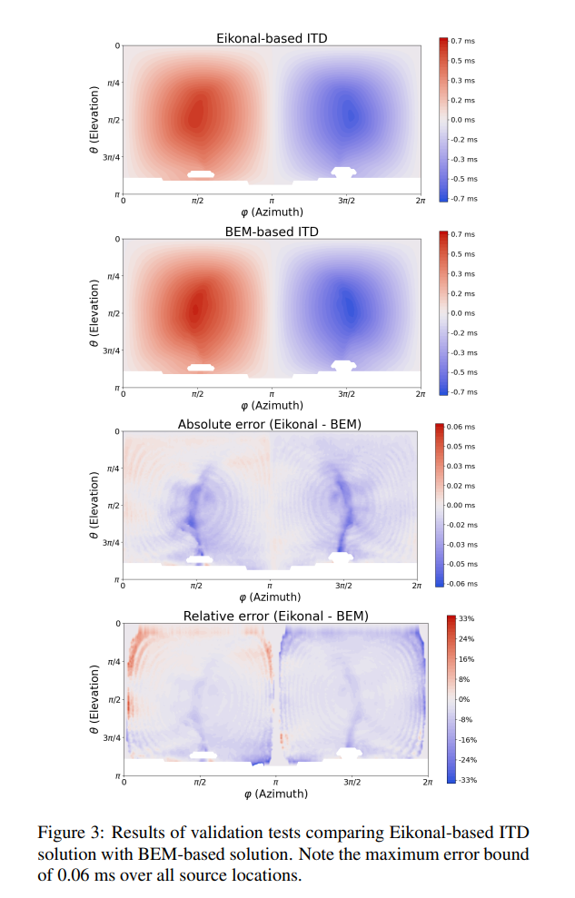
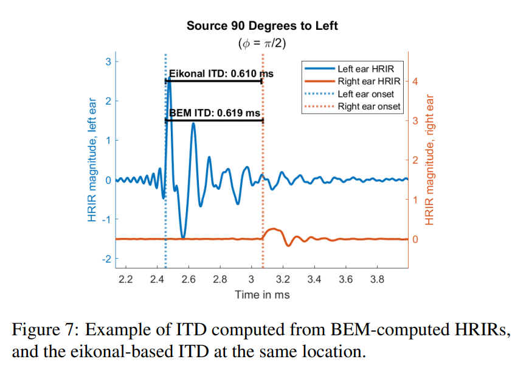

# ITD Figures
Data and scripts for producing ITD figures for Eikonal WASPAA 2023 paper.

## ITD Error Plots
`itd.ipynb` contains the code for producing the ITD error plots in Figure 3. Inside `data/`, `itd_grid_eik.bin` contains the grid of ITD values produced from the eikonal solver, and `itd_grid_bem.bin` contains the values from the BEM solver. There is also `itd_grid_bem_inf.bin` which has ITD values computed for sources at infinite distances away. (This isn't used in the paper, but it is vestigially referenced in `itd.ipynb`.)  

Also in the `data/` folder are two HRIR signals that can be used to construct a new version of the HRIR-ITD overlay from figure 7.

All data files are in Numpy binary format.

## HRIR-ITD Overlay Figure
In `hrir-itd overlay` are Matlab files for recreating Figure 7. The raw HRIR files are there, as well as `plot_hrir_itd_overlay.mlx` which is a Jupyter-style notebook for Matlab that produces the figures. There is also `extract_hrirs.m` which is a matlab script that can extrac new HRIRs for any point on the grid if we wanted different directions than what I already have in there.

